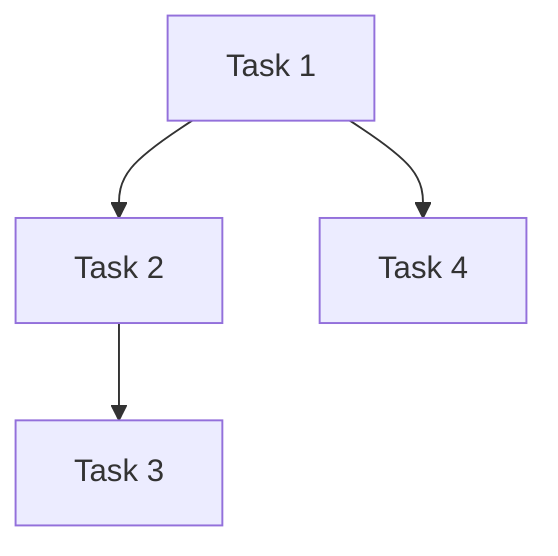

# /deep/plan - Detailed Implementation Planning

Creates comprehensive implementation plan with research, dependency mapping, and risk assessment. Uses thinking tool and multiple research agents.

## When to Use
- Complex feature implementation
- Major refactoring
- Architecture changes
- Multiple file changes
- High-risk modifications

## When NOT to Use
- Simple bug fixes (use `/fix`)
- Single-file changes
- Obvious implementations

## Arguments
$ARGUMENTS - Feature or change description

## Process

1. **Requirements Analysis**
   - Parse user requirements
   - Identify acceptance criteria
   - List constraints

2. **Research Phase** (parallel agents)
   - Search for similar patterns in codebase
   - Research framework best practices
   - Check existing implementations
   - Review related documentation

3. **Dependency Mapping**
   - Identify affected files
   - Map data flow
   - Find integration points
   - List breaking changes

4. **Risk Assessment**
   - Security implications
   - Performance impact
   - Breaking changes
   - Rollback strategy

5. **Step-by-Step Plan**
   - Break into atomic tasks
   - Order by dependencies
   - Estimate complexity
   - Identify checkpoints

6. **Review & Approval**
   - Present plan to user
   - Adjust based on feedback
   - Get explicit approval

## Agents Used
- `explorer` (very thorough) - Pattern discovery
- `architect` - Design decisions
- `best-practices-researcher` - External research
- `framework-docs-researcher` - Framework specifics
- `pattern-recognition-specialist` - Codebase patterns

## Example
```
/deep/plan "Add OAuth authentication with Google and GitHub"
/deep/plan "Migrate from REST to GraphQL"
/deep/plan "Implement real-time collaboration"
```

## Output Format
```
## Implementation Plan

### Feature
[Clear description of what we're building]

### Requirements
- [ ] Requirement 1
- [ ] Requirement 2

### Research Findings
#### Existing Patterns
- [Pattern found in codebase]

#### Framework Best Practices
- [Best practice from docs]

#### Similar Implementations
- [file:line] - Similar pattern we can follow

### Architecture
[Diagram or description of how it fits]

### Files Affected
| File | Change Type | Risk | Complexity |
|------|-------------|------|------------|
| path/to/file.ts | NEW | LOW | 2/5 |
| path/to/file.ts | MODIFY | MED | 4/5 |

### Dependencies


### Risk Assessment
#### Security
- [Risk] - Mitigation: [approach]

#### Performance
- [Risk] - Mitigation: [approach]

#### Breaking Changes
- [Change] - Migration: [approach]

### Implementation Steps

#### Phase 1: Foundation
1. [Task] - Complexity: 2/5
   - Files: [list]
   - Dependencies: None
   - Testing: [approach]

2. [Task] - Complexity: 3/5
   - Files: [list]
   - Dependencies: Task 1
   - Testing: [approach]

#### Phase 2: Core Logic
[Steps...]

#### Phase 3: Integration
[Steps...]

### Quality Gates
- [ ] Tests pass after each phase
- [ ] No breaking changes to public API
- [ ] Performance benchmarks met
- [ ] Security review completed

### Rollback Strategy
[How to undo if something goes wrong]

### Estimated Effort
- Total tasks: [count]
- High complexity: [count]
- Med complexity: [count]
- Low complexity: [count]

### Questions/Unknowns
- [ ] Question 1 - Needs answer before starting
- [ ] Question 2 - Can decide during implementation

---
Ready to proceed? (yes/no)
```

## User Approval Required
Plan must be explicitly approved before implementation begins.

## Rules
- Research before planning
- Plans are ordered by dependencies
- Flag high-risk changes clearly
- Include rollback strategy
- Ask questions before making assumptions
- Use thinking tool for complex decisions
- Run research agents in parallel for speed
